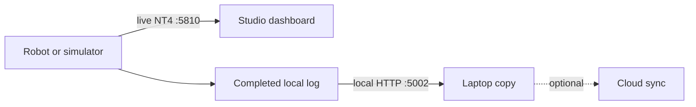

# Watch telemetry and retrieve a local robot log

## Purpose and prerequisites

**Telemetry** is live data sent while a robot program runs. A **log** saves data so you can study it
later. This lab teaches you to tell those two evidence sources apart and retrieve a completed log
without adding cloud access to robot code. Complete [Run Your First FTC
Simulation](/academy/run-first-ftc-simulation?path=robotics-foundations) first.

Use Local Sim for this lesson. The same local services can run on robot hardware, but this activity
does not expose or test a physical robot.

## Vocabulary

- **Telemetry:** changing values published while a program runs.
- **Topic:** a named telemetry value with one fixed data type while announced.
- **NT4:** the live-data protocol used by ARES on port `5810`.
- **Log:** a completed `.csv` or `.csv.gz` file saved for later study.
- **Offline-first:** the robot keeps working without internet or cloud credentials.
- **Rotation:** ending one log file and starting another at a size or time boundary.
- **Queue:** a bounded waiting line of frames for the background log writer.

## Worked example

During a simulated drive, `Drive/Pose_X` changes from `0.20` meters to `0.74` meters. That telemetry
supports a claim about the value seen live. After STOP, the logger closes a `.csv.gz` file. The
student downloads that file through the local log service and finds the same time period. The file
supports later comparison even after the simulator has stopped.

The robot did not upload either result. Studio received live NT4 data on port `5810`, while a
laptop retrieved the completed file from the local HTTP service on port `5002`. Optional cloud sync
belongs to the laptop or Studio, not to robot code.

## Visual model

Active `.active` files are hidden because the writer has not finished them. Only completed CSV or
compressed CSV logs appear for download.

## Hands-on activity

1. Start Local Sim and a TeleOp.
2. Add `Drive/Pose_X`, `Drive/Pose_Y`, and `Drive/Pose_Heading` to a live view.
3. Record their values at rest. Position uses meters and heading uses CCW-positive radians.
4. Move the simulated robot for two seconds, then release the controls.
5. Mark the start and stop times in your notes.
6. Send STOP and let the logger finish its file.
7. Open `http://127.0.0.1:5002/api/logs` on the same computer.
8. Choose one completed `.csv` or `.csv.gz` file and download it.
9. Confirm the laptop copy opens before considering any deletion of the source copy.

Use the graph lab below to practice reading a time series. It is a conceptual data model. It does
not connect to NT4, read your files, or inspect a real robot.

<telemetrygraphlab />

Identify the interval where motion begins, where it is steady, and where it stops. Explain which
shape in the graph supports each answer.

## Checkpoints

Check the topic spelling and type. Leading slashes are normalized, but two different aliases do
not become one topic. A topic's declared type stays fixed for that announcement.

Check the source label in Studio. Live simulation, live robot data, and historical replay may use
the same widget. A familiar chart is not enough to identify its source.

Check that the file is complete. The local service lists completed logs, not active writer files.
Default desktop logs are under `./logs/` relative to the process working directory. Android logs
use `/sdcard/FIRST/telemetry_logs/`.

## Troubleshooting

If the dashboard has no live values, confirm the simulator is connected on port `5810`. Verify that
the publisher calls its update or flush once per frame and that topic types match.

If pose appears twice or flickers, compare raw odometry, fused pose, and estimated-pose aliases.
They should use the same units, frame, and heading sign. Do not hide disagreement by choosing the
last value that arrived.

If no log appears, stop the OpMode and wait for the file to close. Check the process working
directory. A file ending in `.active` is not ready for import.

If a file is listed but download fails, send only its base file name. Path traversal is rejected.
Keep port `5002` on a trusted local robot network and never expose it to the public internet.

## Evidence artifact

Submit a screenshot or table of three named live topics with units and timestamps. Add the
downloaded log's file name, size, and time range. Do not include private cloud credentials or
student identity in the artifact.

Write two claims: one supported by the live view and one supported by the completed log. Add a
limit for each claim. For example, simulation telemetry cannot prove a physical encoder works.

## Short assessment

1. Which port carries live NT4 telemetry?
2. Which port serves completed local logs?
3. Why are active files hidden?
4. Where should optional cloud sync happen?
5. What should you check when two pose topics disagree?

## Extension challenge

Run two short simulations with one changed input. Align their logs by a clear event and compare one
pose topic. State the one variable you changed and two variables you tried to hold constant.

For an advanced software investigation, watch `Diagnostics/Logging/QueueDepth` and
`Diagnostics/Logging/DroppedFrames`. Explain why a bounded logger favors robot-loop progress over
blocking when storage cannot keep up.

## Related and next

Continue with [Simulation Is Not Hardware
Validation](/academy/simulation-is-not-hardware-validation?path=robotics-foundations). For deeper
data work, follow the Controls, Localization, and Autonomous path to odometry and sensor fusion.
