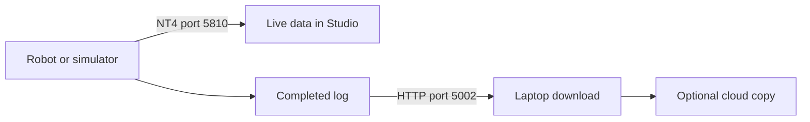

# Watch telemetry and download a robot log

**Telemetry** is live data sent while a robot program runs. A **log** saves data so you can study it
later. ARES serves both on the local robot network. The robot does not need cloud passwords.

## What you will learn

- Find the local telemetry and log services.
- Watch pose values during a simulation.
- Download a completed log safely.

## Try it

1. Start a local simulation and a TeleOp.
2. Watch `Drive/Pose_X`, `Drive/Pose_Y`, and `Drive/Pose_Heading`.
3. Move the simulated robot, then stop it.
4. Stop the OpMode so the logger can finish the file.
5. Open `http://127.0.0.1:5002/api/logs` on the same computer.
6. Download one completed `.csv` or `.csv.gz` file.
7. Check the copied file before deleting the robot-side copy.

Position values use meters. Heading uses radians, and a positive angle turns counter-clockwise.

## Stay on the local network

Do not expose port `5002` to the public internet. It is made for a trusted local robot network.
ARES hides active files because a file still being written may be incomplete. It also hides files
that were placed in quarantine after a problem.

## Check your understanding

Which service is live and which service keeps files? NT4 on port `5810` carries live telemetry.
The HTTP service on port `5002` lists and downloads completed logs. A laptop may copy those logs to
the cloud later, but the robot itself stays offline-first.
