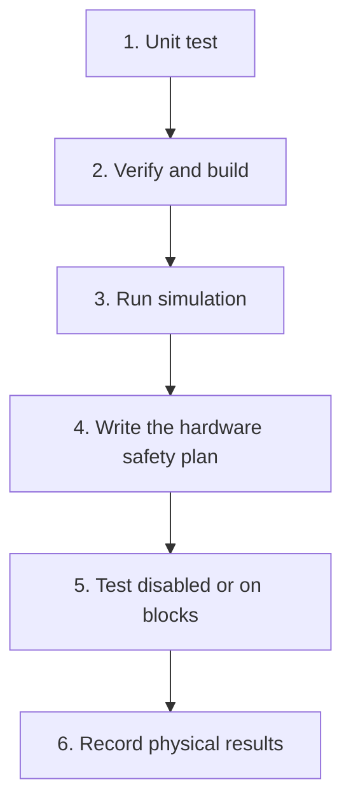

# Know what a simulator can prove

A simulator is a useful test tool. It can check code flow, state changes, and many failure paths.
It cannot see your real wires, wheel direction, or pinch points. A passing simulation is one step,
not permission to run a physical robot.

## What you will learn

- Sort simulation evidence from hardware evidence.
- Move through test steps in a safe order.
- Record what you checked instead of guessing.

## What simulation can check

Simulation can show that actions change state, controllers run, and generated files connect to the
robot lifecycle. It can also test field coordinates and safe responses to many software errors.

Simulation cannot prove:

- which port or motor is connected;
- motor and encoder direction;
- camera position, focus, or exposure;
- wire, CAN ID, current limit, or brake settings;
- space around a moving part or a pinch point;
- access to the emergency stop;
- real robot size, weight, or tuning.

## Use the evidence ladder

Students can carry out each step with the team's robot-safety procedure. For physical checks, keep
the Driver Station disabled until the written step calls for a short hold-to-run test. Use blocks
or another restraint when wheels or mechanisms could move. Keep the emergency stop easy to reach.

## Check your understanding

For each claim, name the lowest evidence step that can support it:

1. “The reducer moves to the stopped state.”
2. “The left-front motor turns the correct way.”
3. “The camera is mounted at the measured angle.”

The reducer can be checked by a unit test. Motor direction and camera mounting need physical
evidence. Move up the ladder only after you record the step below it.
