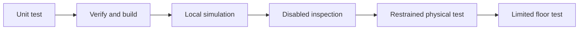

# Know what a simulator can prove

A simulator is a useful test tool. It can check code flow, state changes, and many planned failure
paths. It cannot see real wires, wheel direction, loose parts, or pinch points. A passing simulation
is one kind of evidence. It is not permission to run a physical robot.

## Purpose and prerequisites

This lesson helps you choose the lowest test level that can support a claim. Complete [Run Your
First FTC Simulation](/academy/run-first-ftc-simulation?path=robotics-foundations) first. You should
be able to start and stop a local simulation.

You can lead the evidence review as a student. Follow the team robot-safety procedure when a later
step reaches physical hardware. Website publishing has its own separate review gate.

## Vocabulary

- **Evidence:** recorded information that supports or challenges a claim.
- **Unit test:** a small automated check of one part of the code.
- **Simulation:** software that models selected robot and field behavior.
- **Inspection:** a physical check made while the robot stays disabled.
- **Restrained test:** a short physical test with movement safely limited.
- **Commissioning:** checking a new system in small evidence steps.
- **Claim:** a statement that should be supported by evidence.
- **Boundary:** the limit of what one test can show.

## Worked example

Suppose a stop action should make a reducer return the stopped state. A unit test can send the
action and compare the result. No motor is needed because the claim is only about reducer logic.

Now consider this claim: “The left-front motor turns forward on this robot.” A unit test can check a
software sign. A simulator can check the model. Neither tool can identify the real wire, port, or
motor direction. A short restrained physical test is the first level that can support the full
claim.

One claim may need more than one evidence record. Earlier checks should stay in the record. A later
test adds evidence instead of erasing what came before.

## Visual model

The ladder is not a race to the final box. Stop at the first level that answers the question. Move
forward only when the next claim needs new physical evidence.

## Hands-on activity

Match each claim to the lowest useful evidence level in the activity below. Read the explanation
after checking your choices. If a choice is wrong, name the real fact that the earlier test cannot
observe.

<evidencelevelscenarios />

Create two more claims from your current project. One claim must be about pure software logic. The
other must be about a real component. Place each claim on the ladder and explain why the earlier
levels are not enough.

For the physical claim, write a test outline but do not run it as part of this page. Include a safe
start state, one bounded action, a stop condition, and the evidence to record.

## Checkpoints

Before choosing a level, underline the exact noun in the claim. Words such as reducer, generated
file, modeled path, mounted camera, and real motor point to different boundaries.

Ask whether the selected tool can observe that noun. A simulator can observe its model. It cannot
observe an actual connector. A disabled inspection can observe wiring and position. It cannot prove
the direction of a powered motor.

Keep a visible stop result. An error, mismatch, or unexpected movement is evidence. Do not change a
display or delete a failed trial just to make the result look clean.

## Troubleshooting

If every claim ends at simulation, check for words that describe a real object. Real wiring,
mounting, friction, heat, and direction need physical evidence.

If every claim ends at a floor test, look for a smaller boundary. Reducer behavior needs a unit
test. Generated-code wiring needs build and verification checks. A planned path can be checked in
the model before physical motion.

If a physical test feels too broad, split the claim. Check one device, direction, sensor, or limit
at a time. Use the team safety procedure and keep the emergency stop easy to reach.

## Evidence artifact

Make an evidence table with four columns: claim, lowest useful level, result, and next question. Add
the three interaction claims and your two project claims. Mark any untested claim as planned rather
than passed.

Include one sentence that states a simulation limit. Include one sentence that explains why a
failed test stays in the record. If you later add a physical result, identify who performed the
student review and which team procedure was followed.

## Short assessment

1. What can a unit test prove about a reducer?
2. Why can simulation not prove a real motor direction?
3. What can a disabled inspection observe?
4. Why should earlier evidence stay in the record?
5. What should happen after an unexpected physical result?

A strong answer names the exact claim and the tool boundary. Avoid saying that one test proves the
whole robot works.

## Extension challenge

Choose one simulated feature and build a five-step evidence plan. Begin with the smallest software
test. End at the first physical step that the claim truly needs. Do not add a floor test unless the
claim requires robot movement on the floor.

For each step, write the expected result, the stop condition, and the saved artifact. Ask another
student to find one claim that is too broad. Revise that claim into smaller parts.

## Related and next

Continue into Testing, Debugging, and Commissioning with telemetry graphs, logs, fault trees, and a
bounded commissioning record. Revisit [Commission an FTC Starter Robot
Safely](/academy/ftc-starter-physical-commissioning?path=ftc-robot-with-ares) when the project is
ready for student-led physical evidence.
