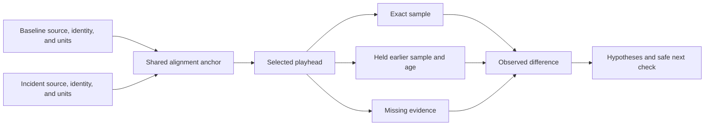

# Compare logs and replay a failure

## Purpose and prerequisites

When a robot acts differently, memory can be misleading. A log keeps values and events from one
completed run. Replay lets you inspect that record without calling it live data. In this lesson,
you will compare one normal run with one problem run. You will state what the data shows before you
guess why it happened.

Complete [Read a Telemetry Graph Like a Scientist](/academy/read-a-telemetry-graph?path=math-for-robotics)
and [Simulation Is Not Hardware Validation](/academy/simulation-is-not-hardware-validation?path=testing-debugging-commissioning)
first. Use the invented lab data or approved, privacy-safe logs. Never share student identity,
credentials, account IDs, or private device paths.

Students may choose the runs, check the evidence, and decide what the software record supports.
Lead Coach review is needed only if the result becomes a website post.

## Vocabulary

- **Log:** values and events saved during one completed run.
- **Replay:** a read-only view that follows recorded time.
- **Baseline:** a compatible run used as a normal comparison.
- **Incident:** the run that contains the behavior being studied.
- **Anchor:** a shared event used as time zero for each run.
- **Playhead:** the selected time in a replay.
- **Exact sample:** a value recorded at the playhead time.
- **Held value:** the newest value recorded before the playhead.
- **Held age:** how long ago that held value was recorded.
- **Missing evidence:** no sample exists at or before the playhead.
- **Provenance:** evidence about where a file came from and whether it changed.
- **Hypothesis:** a possible cause that still needs a test.

## Worked example

The interactive lab uses two invented arm runs. Each run has five current samples and five position
samples. The two runs mark the same event at different source times.

At 40 ms after run start, the baseline current is 3 A. The incident current is 7 A. After alignment
by the shared event, time zero points to 3 A in the baseline and 10 A in the incident. The values did
not change. Only the meaning of time zero changed.

At 50 ms before the shared event, the baseline has no earlier sample. The incident holds its 1 A
sample from 60 ms before the event, so its held age is 10 ms. The lab does not borrow the baseline's
future sample. It reports missing evidence instead.

A careful observation is: “At the shared event, incident current is 7 A higher than baseline
current.” “The arm jammed” is only a hypothesis. A blocked part, a changed load, a sensor problem,
or another cause could fit the same small record.

## Visual model

ARES replay keeps stable recorded order. At one playhead, it builds one snapshot from the newest
sample at or before that time. It never fills a gap with a future value or a current live value.

*Studio 3.1.2 keeps provenance and limits next to the selected run. Read those fields before using
a graph or proposing a cause.*

## Hands-on activity

### Part 1: use the small comparison model

1. Keep **run start**, **current**, and **0 ms** selected.
2. Move the evidence time to **+40 ms**. Record both exact current values and their difference.
3. Change the anchor to **shared event**. The lab returns to **0 ms**.
4. Confirm that table values stayed the same even though the timestamps moved.
5. Record the two exact values at the shared event and their difference.
6. Move the evidence time to **-50 ms**. Find the missing baseline and the held incident value.
7. Explain why using a future baseline sample would create false evidence.
8. Switch to position. Keep radians separate from amps. Then reset the lab.

<logcomparisonlab />

This model does not run ARES Robotics Studio. It teaches alignment and the exact-held-missing rule
with invented values.

### Part 2: use the current Studio workflow

9. In Studio, choose the expected team, season, and robot workspace.
10. Install or reuse the bundled Academy practice pack. It contains two synthetic CSV runs under
    `.ares/academy/practice-runs`. Existing files with different bytes are not overwritten.
11. Import both runs through **Data → Log Imports**. Read the filename, decoder, accepted and
    rejected record counts, warnings, and SHA-256 digest.
12. Open **Analysis → Guided Run Review**. Read **Data source**, **Freshness**, and
    **Interpretation confidence** before reading a graph.
13. Choose one signal and unit. Use only an anchor that appears in every selected run.
14. Open replay at one evidence time. Check whether the value is exact, held, or missing.
15. Export the bounded Markdown report beside the original logs. Do not change the source files.

Guided review and replay are read-only. They do not change robot code, apply tuning, publish a
website post, or command hardware. Import and replay can work offline.

## Checkpoints

- Do all compared runs name the same team, season, and robot?
- Do the selected signals use the same unit and meaning?
- Does the chosen anchor exist in every run?
- Did alignment move timestamps without changing values?
- Is each replay value labeled exact, held with an age, or missing?
- Was a future value kept out of the earlier playhead?
- Are observations separate from hypotheses?
- Does the next action keep the original logs unchanged?

## Troubleshooting

| Symptom | Check |
| --- | --- |
| Peaks happen at different times | Compare run start, autonomous start, a shared event, and a shared note. |
| A value stays visible between samples | Read its held age. It is not a new sample. |
| One run has no comparison option | Check workspace identity and make sure every run has the anchor. |
| A missing topic looks like zero | Stop. Missing evidence is not a healthy zero. |
| Two graphs use different units | Separate them or use one reviewed conversion rule. |
| A possible cause sounds certain | Call it a hypothesis and name a test that could reject it. |
| File origin is unclear | Return to the import report and preserve the digest and warnings. |
| Replay says it is unavailable | Keep the source log, reopen the run, and check Studio operation logs. |

## Evidence artifact

Create one short comparison report. Include workspace identity, source filenames, digests or
provenance status, timestamp range, and freshness. Name the baseline reason, anchor, signal, and
unit. Record the evidence time, exact or held state, held age, observed difference, two hypotheses,
missing evidence, limits, and one safe next action.

Keep the original logs unchanged. A screenshot can support one timestamped observation, but it does
not replace the source file and import record. Remove student names, emails, account IDs, private
paths, and credentials before sharing the report.

## Short assessment

1. What does an alignment anchor change?
2. What makes a sample exact?
3. Why must a held value show its age?
4. Why can missing evidence not become zero?
5. How is an observation different from a hypothesis?

## Extension challenge

Plan a comparison of three runs. Name one question, the identity checks, anchor, signal, unit, and
stop condition. Pick one result that would weaken your favorite hypothesis. A useful experiment can
show that an idea is wrong.

## Related and next

Continue to fault trees and commissioning. Use
[Read Telemetry and Spot a Useful Pattern](/academy/telemetry-and-control?path=testing-debugging-commissioning)
for ARES topics and units. Replay remains historical evidence. It cannot prove the robot's current
configuration or physical safety.
