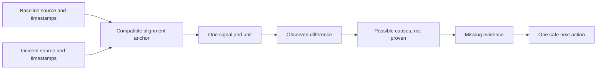

# Compare logs and replay a failure

## Purpose and prerequisites

A log is a record of what a system reported over time. A replay lets you inspect that historical
record without pretending it is live. This lesson compares one baseline run with one incident run
and keeps observation separate from possible cause.

Complete [Read a Telemetry Graph Like a Scientist](/academy/read-a-telemetry-graph?path=math-for-robotics)
and [Simulation Is Not Hardware Validation](/academy/simulation-is-not-hardware-validation?path=testing-debugging-commissioning)
first. Use synthetic Academy data or approved, privacy-safe logs. Never upload credentials, student
identity, or private device information.

## Vocabulary

- **Log:** recorded data and events from a completed run.
- **Replay:** a read-only view that follows recorded time.
- **Baseline:** a compatible run used for comparison.
- **Incident:** the run that contains the behavior being investigated.
- **Anchor:** a shared event used to align timelines.
- **Timestamp:** the recorded time attached to a sample.
- **Held value:** the newest recorded value at or before the replay time.
- **Provenance:** evidence about where a file came from and whether it changed.
- **Observation:** a fact visible in the data.
- **Hypothesis:** a possible explanation that still needs a test.

## Worked example

Two synthetic arm runs record position, velocity, current, enabled state, and a shared “cycle begins”
event. The baseline reaches its target while current stays bounded. The incident stops changing
position while current rises.

A careful observation is: “After the shared event, the incident position stays nearly flat while
its current is higher than the baseline.” “The arm jammed” is a hypothesis. The same signals could
also fit a blocked mechanism, wrong scale, failed sensor, different load, or another cause.

The runs must share team, season, robot, compatible source, and units before the comparison means
what the student thinks it means. Alignment by run start answers one question. Alignment by a shared
event answers another. Moving timestamps does not change recorded values.

## Visual model

ARES replay uses recorded timestamps and stable ordering. It does not borrow a future value to fill
a gap. A missing topic means missing evidence, not a healthy zero.

## Hands-on activity

1. Open the lab with current selected.
2. Read the baseline and incident values before changing alignment.
3. Write one observation using only visible numbers and units.
4. Change alignment from run start to shared event.
5. Confirm that timestamps shift while every recorded value stays the same.
6. Switch from current to position. Keep the units separate.
7. Record the largest same-index difference for each signal.
8. Write two possible causes and label both as hypotheses.
9. List the missing signals or physical facts needed to distinguish them.
10. Reset before a second student repeats the work.

<logcomparisonlab />

Next, use the bundled synthetic Academy practice runs in Guided Run Review. Confirm the workspace
identity and data source before reading a graph. Align by the shared event only if both selected runs
contain it. Open replay at one evidence timestamp and verify the named topics.

## Checkpoints

- Are baseline and incident compatible by team, season, robot, source, and units?
- Is the chosen anchor present in every run?
- Did alignment change timestamps without changing recorded values?
- Does each graph or table contain one physical unit?
- Are observations separate from hypotheses?
- Is missing data labeled missing rather than zero?
- Is replay visibly historical instead of live?
- Does the next action preserve the original logs?

## Troubleshooting

| Symptom | Check |
| --- | --- |
| Peaks happen at different apparent times | Compare run-start, autonomous-start, event, and annotation anchors. |
| A line holds steady between samples | Check whether replay is showing the last recorded value and its held age. |
| One run has no comparison option | Confirm compatible identity and a shared anchor in every selected run. |
| Missing topic appears healthy | Treat it as missing evidence; never replace it with zero or current live data. |
| Two graphs use different units | Separate the signals or convert with an explicit reviewed rule. |
| A possible cause sounds certain | Rewrite it as a hypothesis and name the evidence that could reject it. |
| File origin is unclear | Return to the import report and preserve filename, decoder, warnings, and digest. |

## Evidence artifact

Export a bounded comparison report with source identity, digest or provenance status, timestamp
range, freshness statement, baseline reason, and alignment anchor. Include signal names, units,
observed differences, two hypotheses, missing evidence, limitations, and one safe next action.

Keep the original logs unchanged. A screenshot can support a timestamped observation, but it does
not replace the file and import record. Remove student names, emails, account IDs, private paths,
and credentials from any shared artifact.

## Short assessment

1. What does an alignment anchor change?
2. Why is a held value different from a new sample?
3. Why does a missing topic not mean zero?
4. How is an observation different from a hypothesis?
5. Why must baseline and incident identity be compatible?

## Extension challenge

Write a comparison plan for three runs. Name the one question, compatibility checks, anchor, signal,
unit, and stop condition. Predict one result that would weaken your favorite hypothesis. A strong
experiment can show that an idea is wrong.

## Related and next

Continue to fault trees and commissioning. Use
[Read Telemetry and Spot a Useful Pattern](/academy/telemetry-and-control?path=testing-debugging-commissioning)
for ARES topics and units. Replay evidence remains historical and cannot prove the robot's current
configuration or physical safety.
