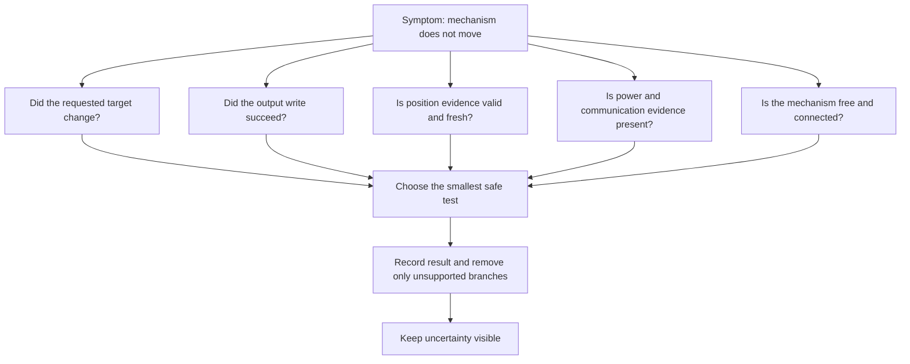

# Build a fault tree and isolate a cause

## Purpose and prerequisites

A symptom tells you what was noticed. It does not tell you why it happened. A fault tree turns one
symptom into several possible branches, then uses the smallest safe tests to remove branches.

Complete [Compare Logs and Replay a Failure](/academy/testing-logs-replay?path=testing-debugging-commissioning)
and [Map Hardware and Diagnose a Dead Device](/academy/electrical-hardware-map-diagnostics?path=electrical-systems-diagnostics)
first. Use approved, privacy-safe evidence. Keep a physical robot disabled and restrained until the
team's student-led safety procedure reaches the correct test boundary.

## Vocabulary

- **Symptom:** the behavior that was noticed.
- **Fault tree:** a branching list of possible explanations.
- **Branch:** one group of possible causes.
- **Leaf:** one testable possibility at the end of a branch.
- **Observation:** a fact supported by named evidence.
- **Hypothesis:** a possible explanation that still needs a test.
- **Discriminating test:** a test whose result separates two possibilities.
- **Root cause:** the confirmed reason a failure occurred.
- **False positive:** evidence that appears to show a fault when none exists.
- **Stop condition:** a result that ends the test before risk grows.

## Worked example

The symptom is “the arm does not move.” That sentence does not prove a jam. The request may never
have changed. A guard may have blocked it. The output write may have failed. Power or communication
may be missing. The position signal may be stale. The mechanism may be disconnected or blocked.

Start with evidence that changes no output. Check whether the requested target changed. If it did
not, inspect the input, action, reducer, and guard path. If the target changed, inspect the cached
output command and write result. A failed write keeps the investigation in software identity,
communication, or adapter branches.

Suppose the write succeeded but recorded position stayed still. That still does not prove a jam.
Current, an independent motion observation, wiring, power, and sensor validity remain open. High
current supports a load or jam branch, but an incorrect current or position signal can fit too.

## Visual model

ARES uses cached input, reported output-write results, health, faults, timestamps, and logs as
software evidence. Those signals help isolate a boundary. They do not replace a physical check.

## Hands-on activity

1. Open the lab with every evidence choice unknown.
2. Copy the open branches and smallest safe next test.
3. Set the requested target to not changed. Explain why a motor swap would be a poor first action.
4. Reset, then set the target to changed and the output write to failed.
5. Record which branches stay open and why motion evidence is not yet useful.
6. Set the write to succeeded and motion to still.
7. Compare the result with current unknown, normal, and high.
8. Write two competing hypotheses for the high-current result.
9. Name one result that would weaken each hypothesis.
10. Reset before another student repeats the tree.

<faulttreelab />

Now build a paper tree for one approved real or synthetic symptom. Every leaf must name an evidence
source, a safe test, an expected result, a stop condition, and what remains unknown.

## Checkpoints

- Is the top statement a symptom rather than a guessed cause?
- Do branches cover software, identity, communication, evidence, power, and physical possibilities?
- Does each leaf have a result that could disprove it?
- Is the next test the smallest safe test that separates branches?
- Are timestamps, units, validity, and freshness attached to signal evidence?
- Does missing evidence stay missing rather than becoming zero or healthy?
- Are high-risk physical tests placed after software and restrained checks?
- Does the record preserve unexpected results instead of hiding them?

## Troubleshooting

| Problem | Better move |
| --- | --- |
| The tree starts with “bad motor” | Rewrite the top as the visible symptom. |
| Every branch ends with “replace part” | Add observations that separate configuration, evidence, power, and mechanism. |
| A test changes several things | Change one bounded condition and preserve the baseline. |
| Missing telemetry looks normal | Label the signal missing and add a collection test. |
| A passing mock closes the wiring branch | Keep physical wiring and connection evidence open. |
| The favorite idea cannot be disproved | Write a result that would weaken it or remove it from the tree. |
| The robot moves unexpectedly | Stop, neutral outputs, preserve evidence, and return to the safety procedure. |

## Evidence artifact

Create a privacy-safe fault-tree report. Include the symptom, first timestamp, project revision,
baseline, branches, evidence sources, units, freshness, tests, results, branches removed, branches
still open, stop conditions, repair, and controlled retest.

Do not include student names, emails, account IDs, private paths, credentials, or unrelated logs.
Do not rewrite the original evidence. Mark a root cause confirmed only when the result is repeatable,
the repair removes the symptom, and a controlled test checks for return.

## Short assessment

1. Why is “the motor is bad” not a useful top symptom?
2. What makes a test discriminating?
3. Why can high current support more than one branch?
4. What should happen to missing sensor evidence?
5. What evidence is needed before calling a root cause confirmed?

## Extension challenge

Create a second tree for a pose that jumps during a mode transition. Include state handoff, process
restart, coordinate convention, timestamp, sensor validity, and estimator branches. Choose one safe
test that separates state handoff from coordinate error without changing both at once.

Before building either tree, use the post-match triage lab below. It orders the safe-state, symptom,
source, inspection, ownership, next-test, and return-status records. It cannot inspect a robot,
confirm a cause, authorize a repair, or allow return to play.

<postmatchtriagelab />

## Related and next

Continue to [Commission an FTC Starter Robot Safely](/academy/ftc-starter-physical-commissioning?path=testing-debugging-commissioning).
Use [Test Robot Logic Across Mocks and Simulation](/academy/programming-tests-parity?path=programming-with-ares)
to add controlled failures before physical testing. Later, use SysId only for a suitable healthy
system and a bounded tuning question. A fault tree cannot authorize motion or replace stop controls.
For the complete competition handoff, use [Review, Repair, and Record after a Match](/academy/competition-post-match?path=competition-operations).
