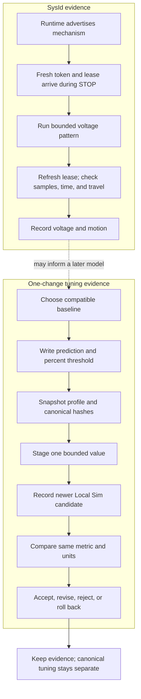

# Run SysId and a bounded tuning experiment

## Purpose and prerequisites

System identification, or **SysId**, records how a mechanism moves when it gets a known voltage.
The data can help estimate a simple model. A tuning experiment asks a different question: does one
small, declared value change improve one recorded result?

This lesson keeps those jobs separate. You will trace a SysId safety envelope, then judge one
invented tuning comparison. You will not move a robot or change a real tuning profile.

The source examples match ARES 16.0.1 and Studio 6.0.1. The links below are pinned to the exact
monorepo commit used for this lesson.

Complete [Build a Fault Tree and Isolate a Cause](/academy/testing-fault-tree?path=testing-debugging-commissioning),
[Predict Motion with Feedforward](/academy/controls-motor-model-feedforward?path=controls-localization-autonomous),
and [Tune Feedback with Evidence](/academy/controls-pid?path=controls-localization-autonomous).

Use the interactive model or an approved Local Sim run. Physical SysId is a separate student-led
robot test. It needs the team's safety process, a clear test area, a reachable stop, correct
mechanical limits, and a student who watches the whole run. This page does not authorize motion.

## Vocabulary

- **SysId:** a controlled test that records voltage and motion.
- **Quasistatic:** a voltage ramp that rises slowly.
- **Dynamic:** a short voltage step used to study acceleration.
- **Mechanism capability:** a mechanism the connected runtime says it can test.
- **STOP-first handshake:** a fresh enable token and a newer lease sequence sent while the command
  is STOP.
- **Lease:** a short-lived heartbeat that must keep advancing during FTC calibration control.
- **Parameter:** one named value with a type, unit, bounds, and apply policy.
- **Baseline:** the unchanged run used for comparison.
- **Candidate:** the run made after one proposed change.
- **Metric:** the recorded result used to judge a prediction.
- **Threshold:** the smallest useful percentage change chosen before the candidate run.
- **Confound:** another change that makes the result hard to explain.
- **Inconclusive:** a result that does not support improvement or regression.
- **Rollback:** remove the staged candidate and return to the earlier setup.
- **Provenance:** where a value and its evidence came from.

## Worked example

### Part A: trace SysId without claiming a real run

The current shared ARES manager has two routine shapes. A quasistatic test ramps voltage at 1.2
volts per second. A dynamic test uses a step. The exact direction depends on the mechanism. Every
shared routine stops after five seconds. Linear, angular, elevator, and arm tests also have travel
checks. Invalid position, heading, velocity, or time data stops the shared routine.

Those checks are not the whole platform safety system. Studio first requires the connected runtime
to advertise the selected mechanism. FTC motion also needs a STOP-first handshake. The enable token
must be new, and the lease sequence must move forward while STOP is selected. The controller then
expects a newer valid lease within 500 milliseconds. A changed token, bad lease, expired lease, or
unknown command disarms calibration and neutralizes its output.

One current limit must stay visible: the FTC and FRC callers do not pass measured current into the
shared `checkSafety` call. The manager contains a current watchdog, but those callers do not provide
the current sample needed to use it. Do not count that watchdog as physical protection. The team
must use verified platform limits and its real safety process.

| Check | What the current source does | What this proves |
| --- | --- | --- |
| Capability missing | Blocks the start in Studio | The runtime did not claim support |
| STOP-first token or lease missing | Blocks arming | Retained controls cannot start a new session |
| Lease older than 500 ms | Disarms and neutralizes | A stopped heartbeat closes the motion boundary |
| Token changes after arming | Disarms and neutralizes | Another session cannot reuse the old arm state |
| Invalid motion sample | Stops the shared routine | The manager failed closed for that sample |
| More than five seconds | Stops the shared routine | The shared time limit fired |
| Travel beyond the mechanism limit | Stops the shared routine | The shared travel limit fired |
| High current | Not supplied by current FTC/FRC callers | Nothing about over-current protection |

### Part B: judge one tuning result

An invented arm baseline settles in 1.20 seconds. A student predicts that one bounded value change
will lower settling time by at least **10%**. The threshold is a percentage because current Studio
compares percent change, not a fixed number of seconds.

The candidate settles in 1.05 seconds:

```text
improvement = (1.20 - 1.05) / 1.20 × 100
improvement = 12.5%
```

The result meets the 10% threshold, so Studio can label the selected metric **improved**. That label
does not prove the value caused every difference. The student still checks peak error, output,
other metrics, and simulator limits.

If the candidate settles in 1.15 seconds, the improvement is about 4.2%. It moved in the intended
direction but missed the threshold, so the result is **inconclusive**. If it settles in 1.30 seconds,
it moved the wrong way and is **regressed**.

## Visual model



SysId data may help estimate feedforward values. It does not make a tuning change by itself. Guided
tuning also does not write checked-in `.arestuning` files. Promotion is a later review action with a
structured diff, evidence links, history, and atomic replacement.

## Hands-on activity

1. Open the lab and read both result panels before changing a control.
2. In the SysId panel, clear **Runtime advertises this mechanism**. Explain why voltage becomes zero.
3. Reset. Select each failed STOP-first handshake mode. Record each blocked reason.
4. Reset. Set lease age to 501 milliseconds. Explain why the preview stops at zero volts.
5. Reset. Set elapsed time to 5.01 seconds. Record the stop reason.
6. Reset. Set linear travel to 1.51 meters. Record the stop reason.
7. Compare the quasistatic command at 1.00 and 3.00 seconds.
8. Select flywheel and dynamic. Compare its one-way step with the linear dynamic result.
9. In the tuning panel, confirm the default result is 12.5% improved.
10. Set the candidate to 1.15 seconds. Confirm the result is inconclusive.
11. Set the candidate to 1.30 seconds. Confirm the result is regressed.
12. Set the threshold to zero. Explain why the plan is blocked before comparison.
13. Reset. Change candidate evidence to **not simulation**. Explain why Studio filters it out.
14. Set parameters changed to multiple. Explain why the result cannot test one cause.
15. Reset and write an accept, revise, reject, or rollback decision with one reason.

<sysidtuninglab />

The numbers in this lab are invented. They help you trace rules. They are not robot data, a motor
model, or a tuning recommendation.

## Checkpoints

- Can you explain the difference between SysId and a tuning experiment?
- Did the runtime explicitly advertise the mechanism?
- Did a fresh token and newer lease arrive during STOP?
- Is the FTC lease still within its 500 millisecond window?
- Are position, heading, velocity, and time samples valid?
- Did you stop at the first failed safety boundary?
- Did you avoid claiming that the current callers use the manager's current watchdog?
- Does the parameter have a stable ID, type, unit, bounds, and apply policy?
- Was exactly one value staged?
- Were profile and canonical document hashes saved first?
- Does the candidate match the active team, season, and robot?
- Is it newer than the snapshot and tagged as simulation evidence?
- Was the percentage threshold written before the run?
- Does the metric use the same statistic and unit in both runs?
- Are other regressions and missing physical effects recorded?

## Troubleshooting

| Problem | Better move |
| --- | --- |
| The mechanism is not advertised | Do not start. Check the runtime capability list. |
| FTC is not freshly armed | Send STOP, complete the new token and lease handshake, and wait for acknowledgement. |
| The lease stops advancing | Stop. The controller disarms after 500 milliseconds and must be armed again. |
| The enable token changes | Stop. Treat it as a new session boundary and complete a fresh handshake. |
| A sample is invalid or time moves backward | Stop and fix the data path before another test. |
| You expected current protection from this manager | Stop. Verify a real platform current limit instead of assuming one. |
| The system has an unresolved fault | Return to fault isolation before tuning. |
| Two values changed | Roll back and stage one value. |
| The metric has no unit | Choose a unit-bearing topic and preserve its source. |
| The threshold changed after the run | Restore the prior threshold and label the result honestly. |
| The candidate came from a live robot | Do not substitute it for required Local Sim evidence. |
| The candidate belongs to another workspace | Select a run for the active team, season, and robot. |
| The result improved but another metric regressed | Record both and revise or reject the candidate. |
| A value is outside bounds or has the wrong type | Reject it before application. |
| The apply policy requires restart or rebuild | Follow that policy; do not treat the value as live-safe. |

## Evidence artifact

Create one local experiment report. Include the question, prediction, held constants, safety notes,
workspace identity, and snapshot digest. Record one parameter, unit, bounds, apply policy, baseline
and candidate IDs, metric statistic, percentage threshold, result, other changes, limits, decision,
and next test.

For SysId evidence, record the advertised mechanism, routine, start and stop reason, source topics,
and data units. Add the STOP-first handshake, lease result, and every platform boundary that was
actually active. Do not list a guard that the caller did not supply with data.

Remove student identity, credentials, private paths, and unrelated details before sharing. Keep
rejected and rolled-back evidence. A failed prediction can prevent the same mistake later.

Students may verify robot functionality through the team's physical process. A mentor review prompt
inside Studio is optional learning support, not a robot permission role. Website publishing follows
the separate Lead Coach review flow.

## Short assessment

1. Why are SysId and a one-change tuning experiment different jobs?
2. Why must the runtime advertise a mechanism before Studio starts live SysId?
3. Why do FTC arming and the continuing 500 millisecond lease solve different problems?
4. Why can this lesson not claim current protection from the shared watchdog?
5. Why is the tuning threshold a percentage rather than a number of seconds?
6. What makes a candidate run eligible for the current guided workflow?
7. Why does improved evidence not silently change canonical tuning?

## Extension challenge

Design a Local Sim experiment for one feedforward or PID value. Name the typed value, unit, bound,
apply policy, baseline maneuver, metric statistic, percentage threshold, held constants, rollback,
and a second metric that could reveal a regression. Add the workspace, simulation-tag, and snapshot
time checks. Do not run a physical test as part of this plan.

Then sketch a separate SysId record. Choose one supported mechanism and routine. List the STOP-first
handshake, lease timeout, valid samples, time and travel limits, stop action, and one real-world risk
that the shared teaching model does not cover.

## Related and next

Review [Typed Tuning Profiles and Safe Experiments](/docs/typed-tuning-and-safe-experiments) for the
declaration, apply-policy, acknowledgement, consumer, rollback, and promotion contracts behind the
guided comparison.

Use [Test Robot Logic Across Mocks and Simulation](/academy/programming-tests-parity?path=programming-with-ares)
to add failure cases. Continue to the capstones only after you can keep model evidence, Local Sim
evidence, and physical evidence separate. Simulation does not certify hardware safety or competition
results.
