# Run SysId and a bounded tuning experiment

## Purpose and prerequisites

System identification, or SysId, uses measured input and motion to estimate a model. Tuning then
tests whether one declared parameter change improves one named outcome. This lesson focuses on the
experiment record, not automatic tuning.

Complete [Build a Fault Tree and Isolate a Cause](/academy/testing-fault-tree?path=testing-debugging-commissioning),
[Predict Motion with Feedforward](/academy/controls-motor-model-feedforward?path=controls-localization-autonomous),
and [Tune Feedback with Evidence](/academy/controls-pid?path=controls-localization-autonomous).
Use synthetic data or approved Local Sim runs. Physical SysId requires the team's student-led safety
procedure, a suitable restrained setup, an accessible stop, and reviewed platform guidance.

## Vocabulary

- **SysId:** a controlled test used to estimate a system model from input and motion.
- **Parameter:** one named value with a type, unit, bounds, and application policy.
- **Baseline:** the unchanged run used for comparison.
- **Candidate:** the run created after one proposed change.
- **Metric:** the unit-bearing result used to judge the prediction.
- **Threshold:** the minimum meaningful change declared before the candidate run.
- **Confound:** another change that makes the comparison unclear.
- **Inconclusive:** evidence that does not meet the declared threshold in either direction.
- **Rollback:** remove the staged candidate and return to the prior configuration.
- **Provenance:** the identity and history of a value, source file, and evidence record.

## Worked example

A simulated arm takes 1.20 seconds to settle. A student predicts that one bounded parameter change
will reduce settling time by at least 0.10 seconds. Every other intended condition stays fixed.

The candidate settles in 1.05 seconds. The change toward the goal is 0.15 seconds, so the chosen
metric is improved. That does not prove the parameter caused every difference. The student still
checks peak error, output limits, other regressions, and model limits before deciding.

If the candidate settles in 1.15 seconds, the result is inconclusive. Moving the threshold after
seeing the result would weaken the experiment. If two parameters changed, the comparison is blocked
because either change or their combination could explain the result.

## Visual model

```mermaid
%% aria: A question and prediction lead to one typed parameter inside declared bounds. A configuration snapshot and Local Sim baseline lead to one candidate run. One compatible metric is compared against a threshold declared before the run. The student records improved, regressed, or inconclusive, then accepts, revises, rejects, or rolls back while preserving evidence.
flowchart LR
  Q["Question and prediction"] --> P["One typed bounded parameter"]
  P --> S["Snapshot configuration and hashes"]
  S --> B["Compatible Local Sim baseline"]
  B --> C["One candidate run"]
  C --> M["One metric, unit, and prior threshold"]
  M --> R["Improved, regressed, or inconclusive"]
  R --> D["Accept, revise, reject, or rollback"]
  D --> E["Preserve evidence and limitations"]
```

ARES separates local experiments from checked-in tuning profiles. An accepted experiment is
evidence. It is not a silent write to canonical robot configuration.

## Hands-on activity

1. Open the lab with the default baseline, candidate, threshold, and lower-is-better goal.
2. Confirm the result is improved and copy the signed change.
3. Raise the candidate above the baseline and record the regression.
4. Set the candidate within the threshold and record the inconclusive result.
5. Change the intended direction to higher and predict the result before editing the candidate.
6. Set parameters changed to multiple. Explain why the result is blocked.
7. Enter a zero threshold. Explain why it is not a valid experiment record.
8. Reset and write one accept, revise, reject, or rollback decision with a reason.
9. Name one metric that could regress while the intended metric improves.
10. List one physical effect missing from Local Sim.

<sysidtuninglab />

In Studio, a bounded experiment begins from a compatible finding. The student writes a falsifiable
prediction, held constants, numeric threshold, safety boundary, one parameter, and one metric. A
candidate run must be newer than the snapshot and tagged as simulation evidence.

## Checkpoints

- Is the system healthy enough for the proposed test?
- Does the parameter have a stable ID, type, unit, bound, and application policy?
- Was exactly one value proposed?
- Were configuration and canonical document hashes saved first?
- Is the baseline compatible with the candidate?
- Was the threshold written before the candidate run?
- Does the metric match the prediction and use compatible units?
- Are regressions and missing physical effects recorded?
- Can the student roll back without changing canonical data?

## Troubleshooting

| Problem | Better move |
| --- | --- |
| The system has an unresolved fault | Stop tuning and return to fault isolation. |
| Two parameters changed | Roll back and stage one change. |
| The metric has no unit | Choose a unit-bearing topic and preserve its source. |
| The threshold changed after the run | Restore the original threshold and label the result honestly. |
| A candidate came from a live robot | Do not substitute it for the required Local Sim evidence. |
| The result improved but another metric regressed | Record both and revise or reject the candidate. |
| A value is outside bounds or uses the wrong type | Reject it before application. |
| A runtime policy requires restart or rebuild | Follow that policy instead of treating it as live-safe. |

## Evidence artifact

Export a bounded experiment report. Include the question, prediction, held constants, safety notes,
workspace identity, and configuration digest. Record one parameter and unit, bounds, application
policy, baseline and candidate IDs, metric, threshold, result, regressions, limitations, decision,
and next test. Remove student identity, credentials, private paths, and unrelated operational details.

Keep rejected and rolled-back evidence. A failed prediction can prevent repeated mistakes. Promote
canonical tuning only through the reviewed structured-diff and history workflow.

## Short assessment

1. Why must a threshold be declared before the candidate run?
2. Why does one-factor testing reduce but not remove confounding?
3. What makes an experiment inconclusive?
4. Why is accepted evidence not a silent canonical write?
5. What must happen when a parameter policy requires restart or rebuild?

## Extension challenge

Design a Local Sim experiment for one feedforward or PID value. Name the typed parameter, unit,
bound, application policy, baseline maneuver, one metric, threshold, held constants, rollback, and a
second metric that could reveal a regression. Do not run a physical test as part of this plan.

## Related and next

Continue to the capstones and competition operations. Use
[Test Robot Logic Across Mocks and Simulation](/academy/programming-tests-parity?path=programming-with-ares)
to add failure cases. Simulation evidence does not certify hardware safety or competition results.
